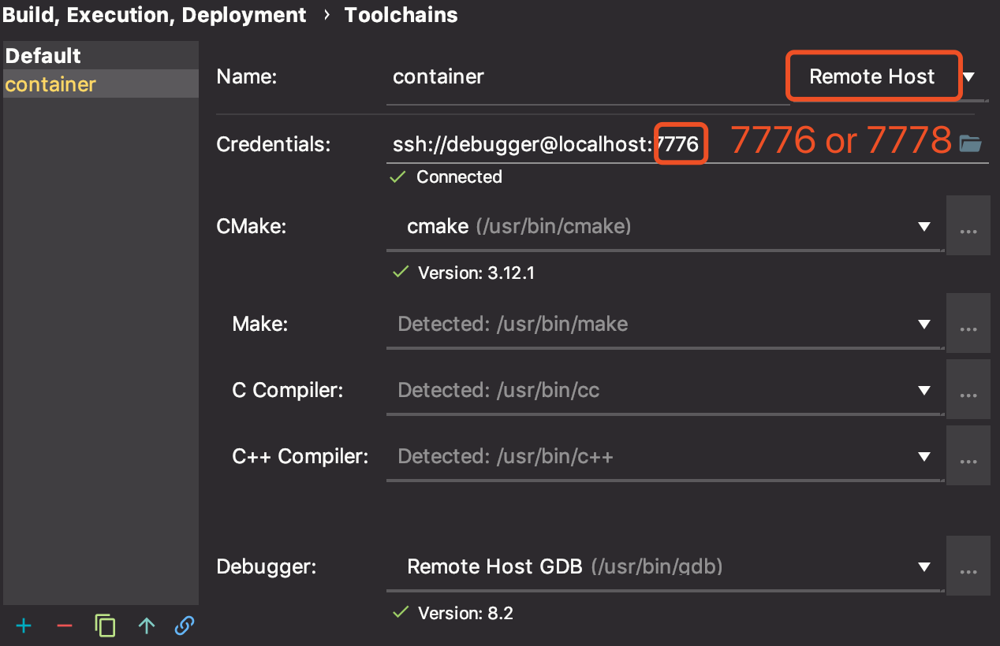
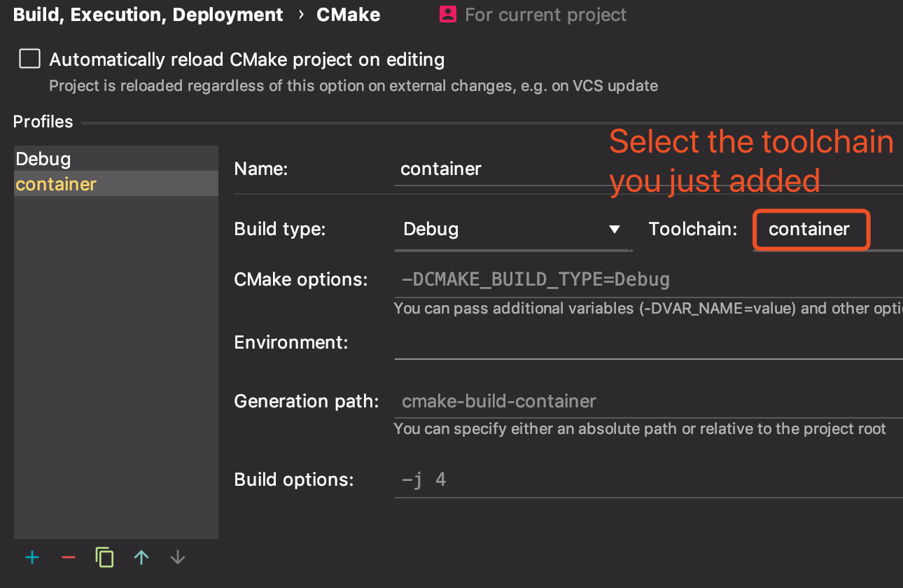
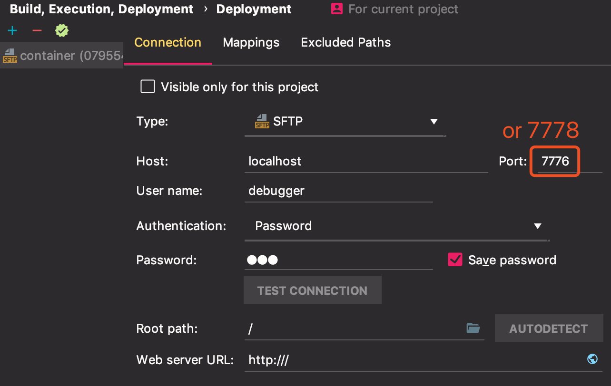
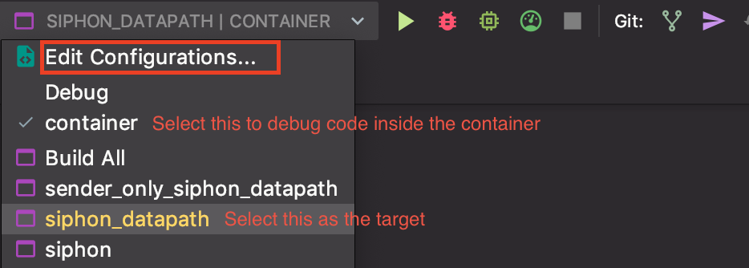
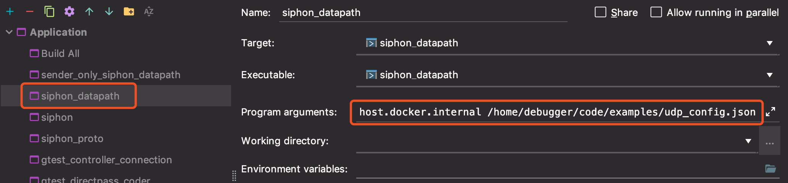

# Debugging with CLion and Containers

## Motivation

Debugging Siphon can be a painful experience. You need more than one `siphon_datapath` process running to test both sender and receiver. All launched processes will have to listen to the same port, which prevents them from running on the same (local) machine. As a result, you need access to at least one remote peer *with a public IP address* to debug even the simplest deployment: one sender and one receiver.

Luckily, [Clion supports remote debugging as of 2018.3 update](https://blog.jetbrains.com/clion/2018/09/initial-remote-dev-support-clion/). With this feature, we can test and debug a cluster deployment locally, inside containers

## Setup Overview

### Processes

Controller will be started on your laptop as a local process.

Each container will be used to run a `siphon_datapath` process. All containers will be connected to the same docker bridge network, so they can address/connect to each other by hostname.

Different from the master `Dockerfile` which will run `siphon_datapath` once started, the debugging containers are basically used as Linux VMs that runs an ssh daemon. `siphon_datapath` must be compiled/executed manually. 

### Connectivity

**Container to Container**: because all containers are connected to the same bridge, they can reach each other at any port number without mapping port numbers to the host.

**Host to Container**: On a Linux box, containers can be reached via an assigned IP address, without mapping port numbers to the host. However, on a Mac, there is a [known limitation](https://docs.docker.com/docker-for-mac/networking/). Therefore, any port number that needs to be accessed from the host (e.g., ssh server port) must be mapped to the host.

**Container to Host**: Host can be reached via a special DNS name `host.docker.internal` from within the container. This will be the controller URL.

## Step-by-Step Instructions

> Note: you must have CLion 2018.3 or above and Docker CE installed.

1. Import `siphon_datapath` project into CLion. CLion will read the master `CMakeLists.txt` and import headers/dependencies/targets automatically. If the project is imported successfully, you should find all `gtest-*` targets in the target drop-down list (located at the UI top-right corner). Sometimes importing the project to CLion results in some automatic modifications to the CMakeLists.txt file such as changing cmake_minimum_required(VERSION 3.12) to cmake_minimum_required(VERSION 3.13). To fix this, run 'git diff' then `git checkout -- CMakeLists.txt`

2. Launch the debugging containers.
  ```
  cd debug_container
  docker-compose up -d
  ```
  The `docker-compose` command will launch two containers running ssh daemon. The ssh user name is `debugger`, and the password is `pwd`. One container with hostname `debug` maps its ssh server port 22 to host port 7776. The other with hostname `peer` maps to host port 7778.

3. Configure the container toolchain in Clion. Go to ***Settings/Preferences | Build, Execution, Deployment | Toolchains*** ***CLion/Preferences | Build, Execution, Deployment | Toolchains (for mac)***, configure a new toolchain for each container. The username is `debugger`. The password is `pwd`. The completed configurations should be similar to the following: 

0. Configure the container CMake settings in CLion. Go to ***Settings/Preferences | Build, Execution, Deployment | CMake***, add a container CMake profile for each toolchain you just added:

0. Check the file mapping settings in Clion. Before each run, code will be `rsync`-ed to the container at a temporariy location. The following configuration should be generated automatically after the previous two steps:

0. In your Clion, you should be able to select one of the `container` profiles (the same as the CMake profile name) before execution. Once this is selected, execution/debugging in CLion will be done inside the selected container rather than on the host. 
Click ***Edit Configurations...*** to provide command line arguments: 

0. `ssh -p 7778 debugger@localhost` to access the peer container. Siphon source code locates under `~/code` directory. Build the project.

0. Launch the controller on the host (your laptop).

0. Now we have two nodes. One can be executed within CLion (by running the code there (not through the terminal)). The other can be executed via the ssh session. Start debugging now!

## Frequent errors

1. Sometimes, after launching the container with `ssh`, it shows the following error message:
```
debugger@peer:~$ cd code
cd: error retrieving current directory: getcwd: cannot access parent directories: No such file or directory
```
Simply, stop, remove and recompose the containers.
### Stop all running containers:
`docker stop $(docker ps -aq)`
### Remove all running containers:
`docker rm $(docker ps -aq)`
### Recompose the containers:
`docker-compose up -d`

2. Also, sometimes rebuilding in debugger@localhost gives the following error:
```
debugger@peer:~/code$ ./build.sh
CMake Error: The current CMakeCache.txt directory /home/debugger/code/build/CMakeCache.txt is different than the directory /Users/apple/Desktop/Siphon/siphon_datapath/build where CMakeCache.txt was created. This may result in binaries being created in the wrong place. If you are not sure, reedit the CMakeCache.txt
CMake Error: The source "/home/debugger/code/CMakeLists.txt" does not match the source "/Users/apple/desktop/Siphon/siphon_datapath/CMakeLists.txt" used to generate cache.  Re-run cmake with a different source directory.
```
Simply, just use `./clean.sh` and rebuild.

3. For executing FEC in Clion under container, you will get an error #include "isa-l": No such file or directory.
SOLUTION:
  * Get the container IDs using `docker ps -aq` or for more detailed information about the containers `docker ps`
  * Bash into each of them using, `docker exec -it mycontainerID bash`
  * Run `./dependencies.sh` in `/home/debugger/code/` directory
  * Make sure to give access to isa-l.h and isa-l using `sudo chmod a+rwx /usr/local/include/isa-l` and `sudo chmod a+rwx /usr/local/include/isa-l.h`


## Building FEC in debugging containers
To run `./dependencies.sh`, you need sudo command which is not installed in the debugger container. To install it, 
1. In debug_container, use `docker ps -aq` to list the running container ID.
2. Use the printed container ID, to access the root using `docker exec -u root -t -i container_id /bin/bash`.
3. Install sudo, `apt-get -y install sudo`.
4. Add debugger to the sudoers, `sudo usermod -aG sudo,adm debugger`.

## FAQs

* **I launched both containers for the second time by running `docker-compose up -d`, but Clion cannot debug the code inside the container anymore. It looks like some `CMakeCache` file is missing.**

  If you encountered a problem where there is something wrong with file sync, try `ssh`ing to the container first. The ssh session will probably fail with the following error message:
  
  ```
  @@@@@@@@@@@@@@@@@@@@@@@@@@@@@@@@@@@@@@@@@@@@@@@@@@@@@@@@@@@
  @    WARNING: REMOTE HOST IDENTIFICATION HAS CHANGED!     @
  @@@@@@@@@@@@@@@@@@@@@@@@@@@@@@@@@@@@@@@@@@@@@@@@@@@@@@@@@@@
  ```
  It happens because an internal `ssh` security mechanism finds "the remote host" has been changed. [This thread](https://stackoverflow.com/questions/20840012/ssh-remote-host-identification-has-changed) lists possible solutions. In short, run `ssh-keygen -R localhost` will do.
